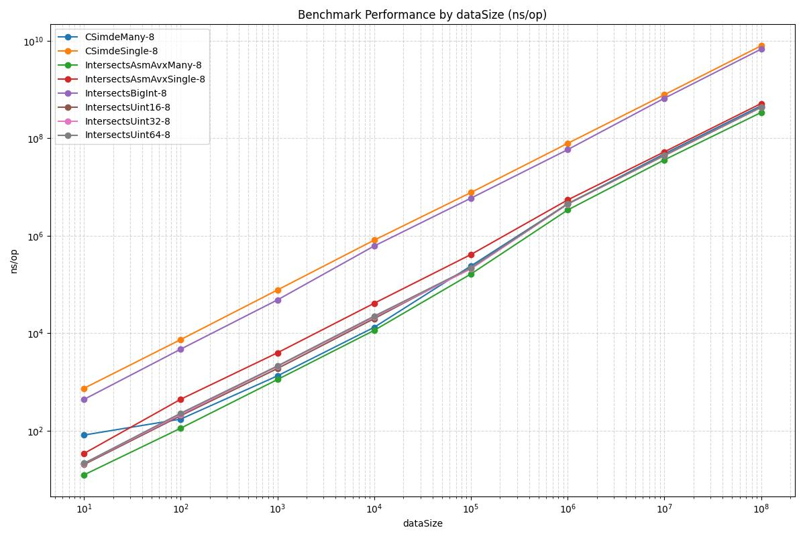

# SIMD(AVX) experiment

This module contains several implementations of bitwise AND operations using different approaches and compares their performance

## Implementations

1. **big.Int**  
   Uses Go's built-in `math/big.Int` type for bitwise operations:
   - Performs memory allocations. No other method does allocate memory, except `big.Int`
   - Worst option in terms of performance
   - Eaziest to implement

2. **CGO + simde**  
   Uses CGO to call C code from the [simde](https://github.com/simd-everywhere/simde) library for `SIMD` bitwise AND:
   - Faster than `big.Int` and no memory allocations  
   - Works well when processing large batches of requests in a single CGO call
   - Not very practical for this project use case

3. **GOASM**  
   Uses hand-written assembly in Go for bitwise AND operations:
   - Single calls are significantly faster than BigInt and multiple CGO calls  
   - No speed gain compared to normal Go `uint` operations on single calls  
   - Batch calls give performance improvement over `uint` and are the fastest overall  
   - Not practical for this project

4. **uint16, uint32, uint64**  
   Uses Go's native unsigned integer types for bitwise operations:
   - Very fast 
   - Best balance of speed and code simplicity

## Benchmark and Testing

- Before running tests or benchmarks, initialize the simde submodule:
  ```bash
  git submodule update --init simde
  ```

- To run benchmarks (with memory allocation stats), use:  
  ```bash
  go test -bench=. -benchmem -dataSize=10000
  ```

- To run tests (which verify all implementations produce identical results):
  ```bash
  go test
  ```

## Benchmark Results on Test Machine

- **CPU:** Intel Ice Lake, 8 vCPUs  
- **RAM:** 32 GB

Below is a summary chart of benchmark results comparing all implementations:



## Bottom line

SIMD(AVX) does not provide any advantages for the project's tasks. `big.Int` is the slowest. It turns out that it is most logical to use `uint` for bit operations in this case